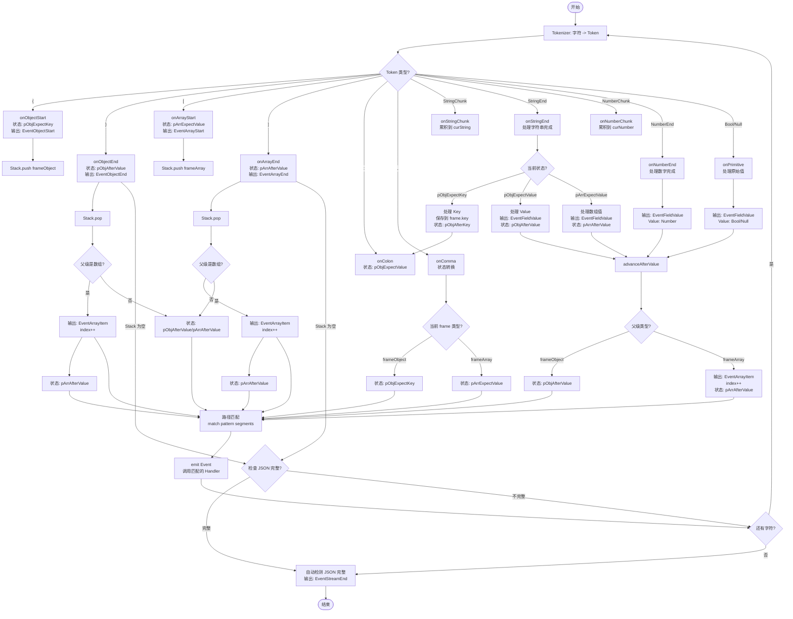
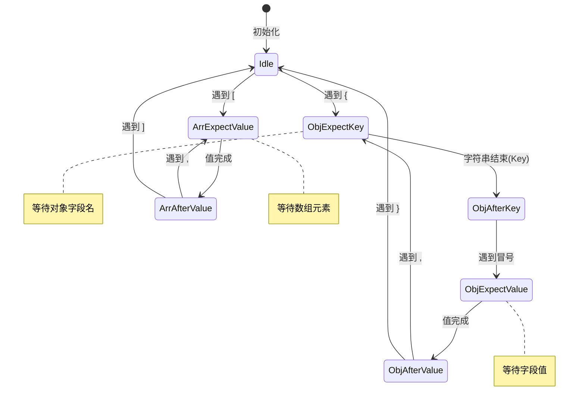
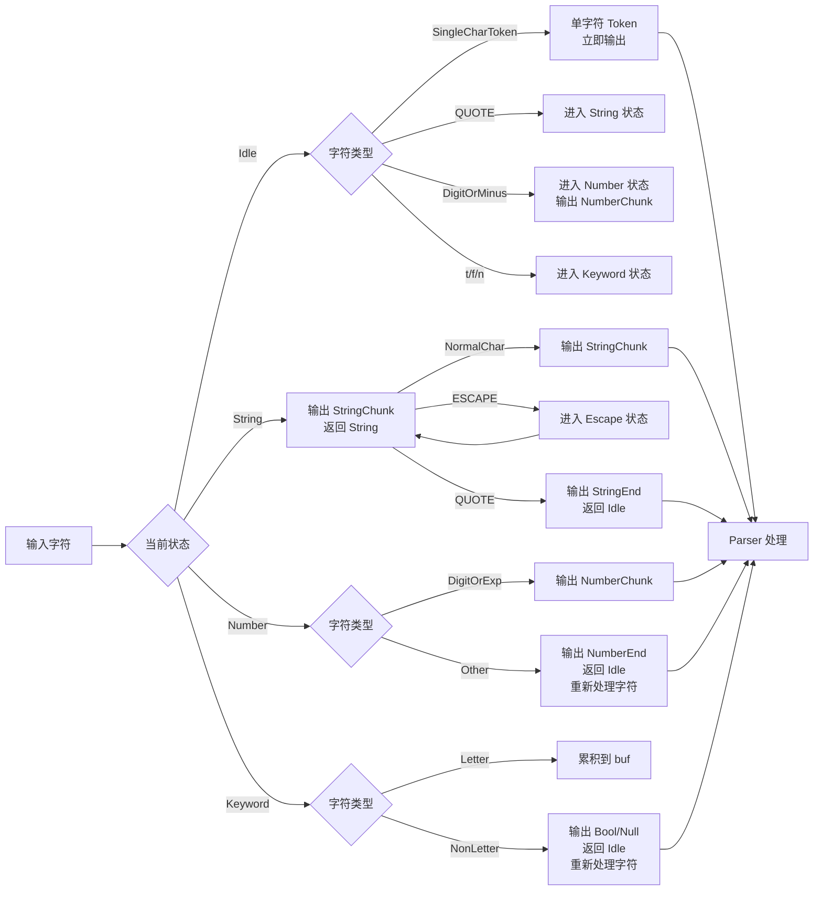
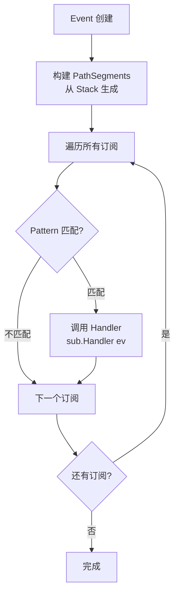

# JSON 流式解析系统流程图

## 系统架构概览

```
+--------------+      +--------------+      +-------------+      +---------------+
| Input Stream | ---> |   Tokenizer  | ---> |    Parser   | ---> | Output Events |
+--------------+      +--------------+      +-------------+      +---------------+
       |                    |                     |                     |
       | Char: { " s t a t u s " : " r u n n i n g " }                  |
       |                    |                     |                     |
       +--------------------+---------------------+---------------------+
                            |                     |
                    Token: LBrace             Event: ObjectStart
                    Token: StringChunk        Event: FieldValue
                    Token: StringEnd          Event: FieldValue (Complete)
                    Token: Colon              ...
                    Token: StringChunk        Event: ObjectEnd
                    Token: StringEnd
                    Token: RBrace
```

## ASCII 动画流程图

### 示例：解析 `{"status": "running"}`

```
+-------------------------------------------------------------------------+
|                         Input Character Stream                          |
|  {  "  s  t  a  t  u  s  "  :  "  r  u  n  n  i  n  g  "  }             |
+-------------------------------------------------------------------------+
                                    |
                                    v
+-------------------------------------------------------------------------+
|                      Tokenizer (Lexical Analysis)                       |
+-------------------------------------------------------------------------+
|  Char: {                                                                |
|    -> Token: TokenLBrace                                                |
|                                                                         |
|  Char: "                                                                |
|    -> State: tString (enter string state)                               |
|                                                                         |
|  Char: s t a t u s                                                      |
|    -> Token: TokenStringChunk("s")                                      |
|    -> Token: TokenStringChunk("t")                                      |
|    -> Token: TokenStringChunk("a")                                      |
|    -> Token: TokenStringChunk("t")                                      |
|    -> Token: TokenStringChunk("u")                                      |
|    -> Token: TokenStringChunk("s")                                      |
|                                                                         |
|  Char: "                                                                |
|    -> Token: TokenStringEnd                                             |
|    -> State: tIdle (return to idle state)                               |
|                                                                         |
|  Char: :                                                                |
|    -> Token: TokenColon                                                 |
|                                                                         |
|  Char: "                                                                |
|    -> State: tString                                                    |
|                                                                         |
|  Char: r u n n i n g                                                    |
|    -> Token: TokenStringChunk("r")                                      |
|    -> Token: TokenStringChunk("u")                                      |
|    -> Token: TokenStringChunk("n")                                      |
|    -> Token: TokenStringChunk("n")                                      |
|    -> Token: TokenStringChunk("i")                                      |
|    -> Token: TokenStringChunk("n")                                      |
|    -> Token: TokenStringChunk("g")                                      |
|                                                                         |
|  Char: "                                                                |
|    -> Token: TokenStringEnd                                             |
|                                                                         |
|  Char: }                                                                |
|    -> Token: TokenRBrace                                                |
+-------------------------------------------------------------------------+
                                    |
                                    v
+-------------------------------------------------------------------------+
|                      Parser (Syntactic Analysis)                        |
+-------------------------------------------------------------------------+
|  Token: TokenLBrace                                                     |
|    -> onObjectStart()                                                   |
|    -> Stack.push(frameObject)                                           |
|    -> State: pObjExpectKey                                              |
|    -> Emit: EventObjectStart                                            |
|                                                                         |
|  Token: TokenStringChunk("s"), TokenStringChunk("t"), ...               |
|    -> onStringChunk("s")                                                |
|    -> curString.append("s")                                             |
|    -> (accumulate string, no event emitted)                             |
|                                                                         |
|  Token: TokenStringEnd                                                  |
|    -> onStringEnd()                                                     |
|    -> Current state: pObjExpectKey (this is a key)                      |
|    -> frame.key = "status"                                              |
|    -> curString.reset()                                                 |
|    -> State: pObjAfterKey                                               |
|                                                                         |
|  Token: TokenColon                                                      |
|    -> onColon()                                                         |
|    -> State: pObjExpectValue                                            |
|                                                                         |
|  Token: TokenStringChunk("r")                                           |
|    -> onStringChunk("r")                                                |
|    -> curString.append("r")                                             |
|    -> chunkBuffer.append("r")                                           |
|    -> curValueKind = valString                                          |
|    -> Emit: EventFieldValue(Value="r", Append=true)                     |
|                                                                         |
|  Token: TokenStringChunk("u"), TokenStringChunk("n"), ...               |
|    -> onStringChunk("u")                                                |
|    -> curString.append("u")                                             |
|    -> chunkBuffer.append("u")                                           |
|    -> Emit: EventFieldValue(Value="u", Append=true)                     |
|    ... (continue accumulating)                                          |
|                                                                         |
|  Token: TokenStringEnd                                                  |
|    -> onStringEnd()                                                     |
|    -> Current state: pObjExpectValue (this is a value)                  |
|    -> Emit: EventFieldValue(Value="running", Complete=true)             |
|    -> curString.reset()                                                 |
|    -> chunkBuffer.reset()                                               |
|    -> curValueKind = valNone                                            |
|    -> State: pObjAfterValue                                             |
|                                                                         |
|  Token: TokenRBrace                                                     |
|    -> onObjectEnd()                                                     |
|    -> Emit: EventObjectEnd                                              |
|    -> Stack.pop()                                                       |
|    -> State: pIdle                                                      |
+-------------------------------------------------------------------------+
                                    |
                                    v
+-------------------------------------------------------------------------+
|                 Path Matching and Event Dispatch                        |
+-------------------------------------------------------------------------+
|  Event: EventObjectStart                                                |
|    -> Build PathSegments: [] (root path)                                |
|    -> Path: "$"                                                         |
|    -> Match subscriptions: $.status, $.*, ...                           |
|    -> Invoke matched handlers                                           |
|                                                                         |
|  Event: EventFieldValue(Path="$.status", Value="running")               |
|    -> Build PathSegments: [Field("status")]                             |
|    -> Path: "$.status"                                                  |
|    -> Match subscription: $.status  (matched)                           |
|    -> Invoke handler(event)                                             |
|                                                                         |
|  Event: EventObjectEnd                                                  |
|    -> Build PathSegments: [] (root path)                                |
|    -> Path: "$"                                                         |
|    -> Match subscriptions and invoke handlers                           |
+-------------------------------------------------------------------------+
                                    |
                                    v
+-------------------------------------------------------------------------+
|                             Output Events                               |
|  EventObjectStart                                                       |
|  EventFieldValue(Path="$.status", Value="running", Complete=true)       |
|  EventObjectEnd                                                         |
+-------------------------------------------------------------------------+
```

## 完整解析流程图



## 详细状态转换图



## Tokenizer 词法分析流程



## 示例：解析 `{"status": "running", "progress": 42}`

### 步骤详解

```
输入字符流: {"status": "running", "progress": 42}
```

| 步骤 | 字符 | Tokenizer 输出 | Parser 状态 | Stack | 输出事件 |
|------|------|----------------|-------------|-------|----------|
| 1 | `{` | TokenLBrace | pObjExpectKey | `[frameObject]` | EventObjectStart |
| 2 | `"` | - | pObjExpectKey | `[frameObject]` | - |
| 3 | `s` | TokenStringChunk("s") | pObjExpectKey | `[frameObject]` | - |
| 4 | `t` | TokenStringChunk("t") | pObjExpectKey | `[frameObject]` | - |
| 5 | `a` | TokenStringChunk("a") | pObjExpectKey | `[frameObject]` | - |
| 6 | `t` | TokenStringChunk("t") | pObjExpectKey | `[frameObject]` | - |
| 7 | `u` | TokenStringChunk("u") | pObjExpectKey | `[frameObject]` | - |
| 8 | `s` | TokenStringChunk("s") | pObjExpectKey | `[frameObject]` | - |
| 9 | `"` | TokenStringEnd | pObjAfterKey | `[frameObject{key:"status"}]` | - |
| 10 | `:` | TokenColon | pObjExpectValue | `[frameObject{key:"status"}]` | - |
| 11 | `"` | - | pObjExpectValue | `[frameObject{key:"status"}]` | - |
| 12 | `r` | TokenStringChunk("r") | pObjExpectValue | `[frameObject{key:"status"}]` | EventFieldValue(Value="r", Append=true) |
| 13 | `u` | TokenStringChunk("u") | pObjExpectValue | `[frameObject{key:"status"}]` | EventFieldValue(Value="u", Append=true) |
| 14 | `n` | TokenStringChunk("n") | pObjExpectValue | `[frameObject{key:"status"}]` | EventFieldValue(Value="n", Append=true) |
| 15 | `n` | TokenStringChunk("n") | pObjExpectValue | `[frameObject{key:"status"}]` | EventFieldValue(Value="n", Append=true) |
| 16 | `i` | TokenStringChunk("i") | pObjExpectValue | `[frameObject{key:"status"}]` | EventFieldValue(Value="i", Append=true) |
| 17 | `n` | TokenStringChunk("n") | pObjExpectValue | `[frameObject{key:"status"}]` | EventFieldValue(Value="n", Append=true) |
| 18 | `g` | TokenStringChunk("g") | pObjExpectValue | `[frameObject{key:"status"}]` | EventFieldValue(Value="g", Append=true) |
| 19 | `"` | TokenStringEnd | pObjAfterValue | `[frameObject{key:"status"}]` | EventFieldValue(Value="running", Complete=true) |
| 20 | `,` | TokenComma | pObjExpectKey | `[frameObject{key:"status"}]` | - |
| 21 | `"` | - | pObjExpectKey | `[frameObject{key:"status"}]` | - |
| 22 | `p` | TokenStringChunk("p") | pObjExpectKey | `[frameObject{key:"status"}]` | - |
| ... | ... | ... | ... | ... | ... |
| 23 | `"` | TokenStringEnd | pObjAfterKey | `[frameObject{key:"progress"}]` | - |
| 24 | `:` | TokenColon | pObjExpectValue | `[frameObject{key:"progress"}]` | - |
| 25 | `4` | TokenNumberChunk("4") | pObjExpectValue | `[frameObject{key:"progress"}]` | - |
| 26 | `2` | TokenNumberChunk("2") | pObjExpectValue | `[frameObject{key:"progress"}]` | - |
| 27 | `}` | TokenNumberEnd | pObjAfterValue | `[frameObject{key:"progress"}]` | EventFieldValue(Value="42", Complete=true) |
| 28 | `}` | TokenRBrace | pIdle | `[]` | EventObjectEnd, EventStreamEnd |

## 路径匹配与事件分发

